# Callout Customizer

[](https://github.com/sevryng/calloutcustomizer/actions/workflows/lint.yml)
[](https://github.com/sevryng/calloutcustomizer/releases/latest)
[](LICENSE)

Right-click any callout in Obsidian to change its icon, color, title, and fold state - all without writing CSS.

Every customization is stored inline in the note as ordinary callout metadata, so each callout can look different, and the styling travels with the file through sync, export, and Git.

```markdown
> [!note|i:telescope c:e41bde]- Field notes
> Collapsed by default, pink, with a telescope icon.
```

| Dark | Light |
| :--: | :--: |
| 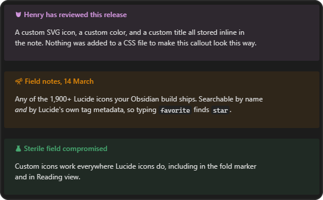 | 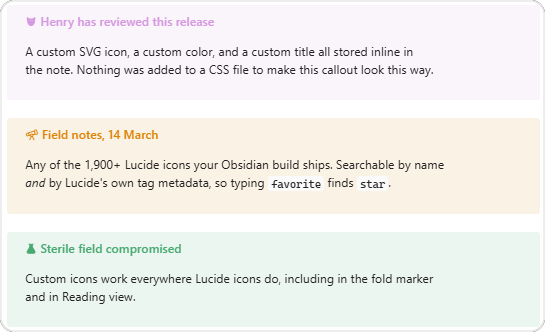 |

## Features

- **The full Lucide set.** Every icon your Obsidian build ships, searchable by name *and* by Lucide's official tag metadata - searching `favorite` finds `star`. Grouped into 46 categories.
- **Any color.** Theme-aware swatches plus a color picker and a hex field.
- **Custom SVG icons.** Paste markup or pick an `.svg` file from your vault.
- **Presets.** Save a look and reapply it from the right-click menu.
- **Custom callout types.** Promote a look to a real type - `> [!corgi]` - written to a CSS snippet so it keeps working even with the plugin disabled.
- **Title and fold state**, edited in the same dialog.
- **Live preview** of the callout and its source line as you edit.

## Showcase

**One type, many looks.** Every callout below is `[!note]` - styling is per-callout, not per-type.

| Dark | Light |
| :--: | :--: |
| 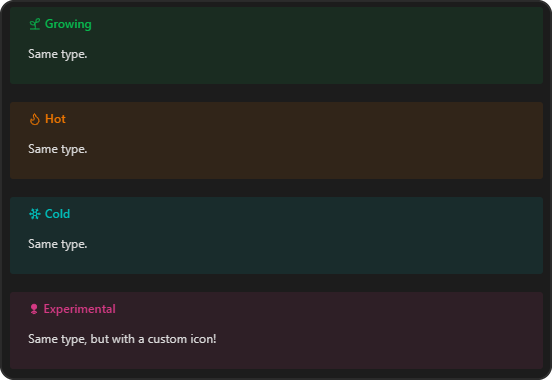 | 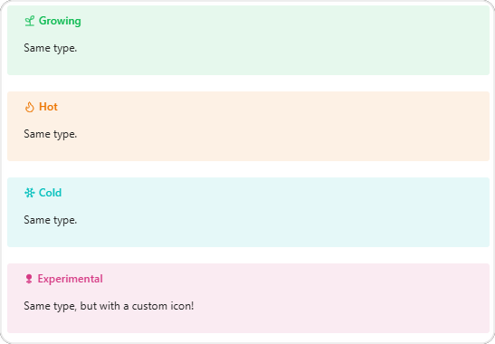 |

**The icon picker.** Every Lucide icon your Obsidian build ships, searchable by name and by Lucide's own tag metadata, filterable by category.

| Dark | Light |
| :--: | :--: |
| 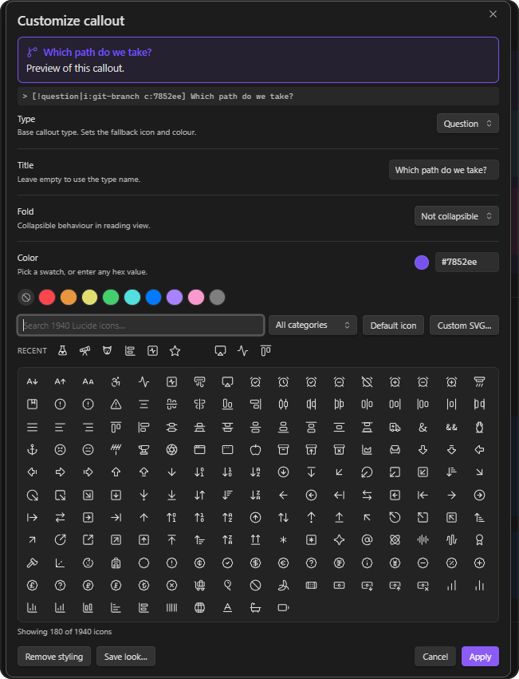 | 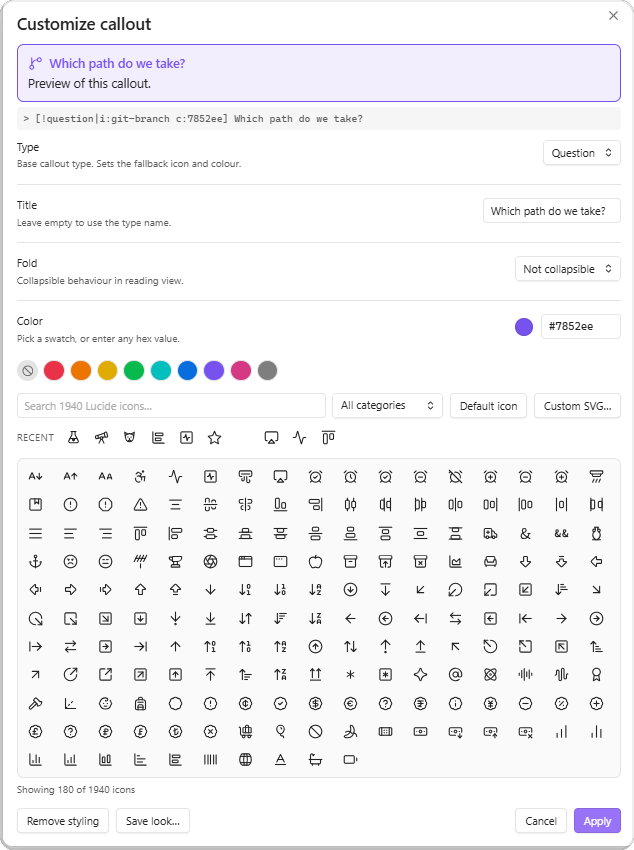 |

**Custom SVG icons.** Paste markup or pick an `.svg` from your vault. Input is sanitized, and a live preview shows the result before you commit to it.

| Dark | Light |
| :--: | :--: |
| 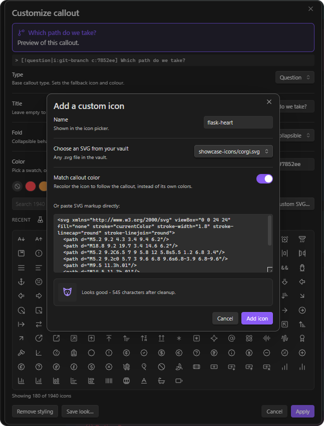 | 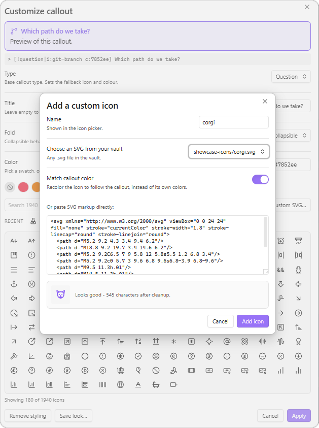 |

**Saved callout types.** Promote a look to a real type and use it with no metadata at all.

| Dark | Light |
| :--: | :--: |
| 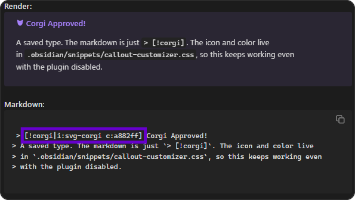 | 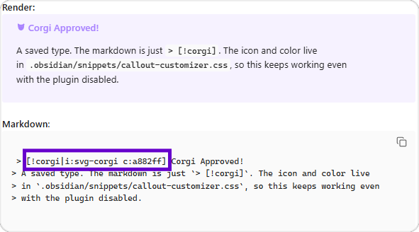 |

The source for these is in [`docs/showcase.md`](docs/showcase.md), and the example icons are in [`docs/icons/`](docs/icons).

## Installing

### From the community plugin list

Not yet listed. Until then, use one of the methods below.

### With BRAT

1. Install the **BRAT** plugin.
2. **BRAT → Add a beta plugin**, and enter `sevryng/calloutcustomizer`.

### Manually

1. Download `main.js`, `manifest.json`, and `styles.css` from the [latest release](../../releases/latest).
2. Put them in `<vault>/.obsidian/plugins/callout-customizer/`.
3. **Settings → Community plugins → Reload plugins**, then enable **Callout Customizer**.

## Using it

Right-click a callout in the editor. This works both on a rendered callout in Live Preview and on the raw source with the cursor inside it.

| Item | Does |
| --- | --- |
| **Edit** | Places the cursor in the callout source |
| **Callout type ▸** | Switches type, including any custom types you've saved |
| **Customize callout…** | Opens the full dialog |
| **Apply preset ▸** | Applies a saved look |
| **Recent icons ▸** | Reuses one of your last icons |
| **Collapse / Expand by default** | Toggles the fold marker |
| **Reset callout style** | Strips the metadata back to type defaults |

In the dialog, double-clicking an icon applies it and closes in one gesture.

### Commands

Assign hotkeys under **Settings → Hotkeys**:

- Customize callout at cursor
- Cycle callout fold state
- Remove customization from callout at cursor

## How customizations are stored

Obsidian exposes anything after the `|` in a callout header as `data-callout-metadata` on the rendered element, in both Live Preview and Reading view. This plugin writes two kinds of token there:

| Token | Meaning |
| --- | --- |
| `i:<name>` | A Lucide icon, for example `i:telescope` |
| `i:svg-<slug>` | One of your custom SVG icons |
| `c:<hex>` | A color, without the `#`, for example `c:e41bde` |

It then generates CSS keyed on those tokens:

```css
.callout[data-callout-metadata~="i:telescope"] { --callout-icon: lucide-telescope; }
.callout[data-callout-metadata~="c:e41bde"]    { --callout-color: #e41bde; }
```

`~=` matches whole space-separated tokens, so `i:star` never collides with `i:starship`.

Metadata you already use is preserved. A callout written as `> [!note|left]` by a theme keeps its `left` token when you add an icon.

To remove everything, delete the `|…` section, or use **Reset callout style**.

## Custom SVG icons

**Custom SVG…** in the icon picker accepts either pasted markup or any `.svg` file in your vault.

Imported markup is sanitized before it is stored: only a whitelist of shape elements and attributes survives, and `on*` handlers, `<script>`, `<foreignObject>`, and external references are dropped. Icons are rendered by adopting parsed nodes rather than assigning HTML.

Custom icons appear in the picker under the **Custom** category and are referenced as `i:svg-<slug>`.

## Presets vs. custom callout types

**Save look…** in the dialog offers two things that sound similar and are not.

| | Preset | Callout type |
| --- | --- | --- |
| You write | `> [!note\|i:star c:e41bde]` | `> [!corgi]` |
| Stored in | Plugin settings | `.obsidian/snippets/callout-customizer.css` |
| Applies to | One callout, when you pick it | Every callout of that type |
| Editing it later | Only affects callouts styled after the change | Updates every existing callout at once |
| Survives the plugin being disabled | No | Yes |
| Needs the CSS snippet enabled | No | Yes |
| Travels with the note | Yes - the look is in the markdown | No - the note needs the vault's snippet |

The trade is between **portability** and **reuse**. A preset bakes the look into the note, so it renders anywhere, but changing the preset later won't touch callouts you already styled. A callout type keeps one definition in one place, so editing it restyles every callout at once - but paste that note into another vault and it falls back to a plain callout.

Use a preset for a look you apply occasionally and want to survive export. Use a callout type for a look that's part of your system and you expect to refine.

The dialog spells this out as you choose, including the markdown each option produces:

| Dark | Light |
| :--: | :--: |
| 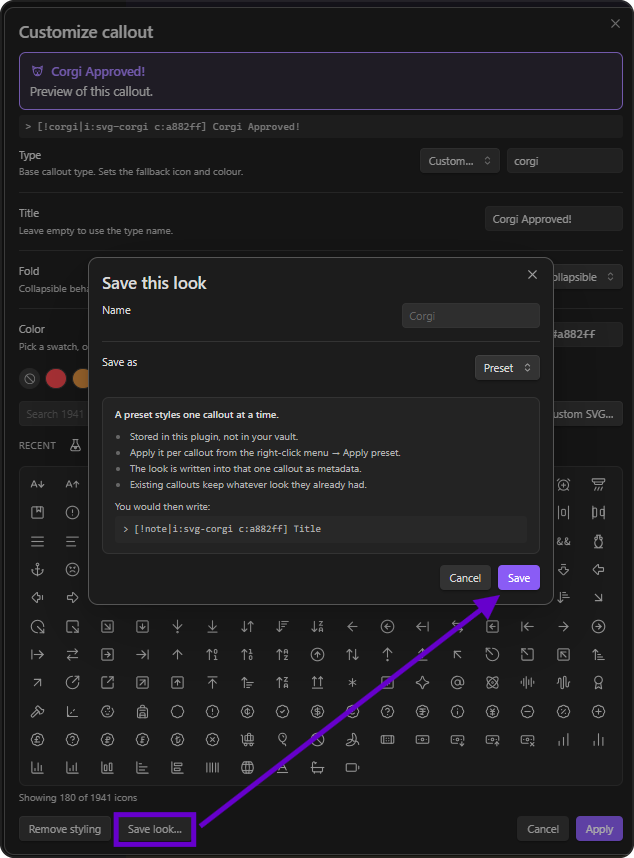 | 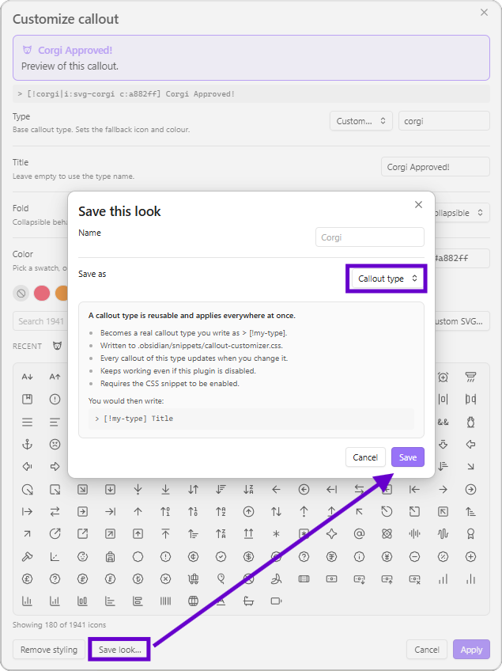 |

**A preset** is stored in plugin settings and applied to one callout at a time, writing inline metadata. Good for a look you use occasionally.

**A custom callout type** becomes a real type you can write anywhere:

```markdown
> [!corgi] Anything
```

Types are written to `<vault>/.obsidian/snippets/callout-customizer.css` as standard Obsidian callout definitions:

```css
.callout[data-callout="corgi"] {
	--callout-color: #e41bde;
	--callout-icon: lucide-dog;
}
```

Because they live in a snippet, they load after your theme and keep working even if this plugin is disabled or removed.

> [!important]
> The snippet has to be enabled before custom types render. Use the **Enable snippet** button in the plugin's settings, or turn on `callout-customizer` under **Settings → Appearance → CSS snippets**.

The snippet is regenerated whenever a custom type changes, so don't hand-edit it. Copy anything you want to keep into a separate snippet file.

## Settings

| Setting | Default | Notes |
| --- | --- | --- |
| Add item to the right-click menu | on | Turn off to leave Obsidian's menus untouched |
| Recent icons submenu | on | |
| Recent icons to keep | 12 | |
| Icon grid size | Medium | Small / Medium / Large |
| Custom icons | - | Add and remove imported SVGs |
| Presets | - | Delete saved presets |
| Custom callout types | - | Delete types, enable or rewrite the CSS snippet |

## Compatibility notes

- **Requires Obsidian 1.5.0** or later.
- **Works on mobile**, though importing an SVG is easier by pasting than by file picking.
- **Obsidian has two different callout context menus.** The rendered-callout menu in Live Preview is built internally and fires no public event, so this plugin intercepts that right-click and rebuilds the menu as a superset: Obsidian's own **Edit** and **Callout type**, plus its own items. It bails out and leaves the native menu alone outside an editor, in Reading view, or when text is selected. This is the part most likely to need attention after a major Obsidian update; turning off the right-click setting disables it entirely.
- **Icon categories are derived, not official.** Lucide publishes `categories.json` only in its GitHub repository, not to npm, so the bundled grouping is derived from each icon's official tag metadata. To use the real grouping, save Lucide's `categories.json` as `lucide-categories.json` inside the plugin folder and reload. Both `{ icon: [categories] }` and `{ category: [icons] }` shapes are accepted.
- **One internal API is used.** Enabling the CSS snippet for you calls `app.customCss`, which is not part of the public API. If it is unavailable the plugin shows a notice telling you to enable the snippet by hand; nothing else depends on it.

## Development

Requires Node 18 or later.

```bash
npm install
npm run dev      # watch build into main.js
npm run build    # type-check, then production bundle
npm test         # parser and color round-trip tests
npm run lint     # ESLint with eslint-plugin-obsidianmd
```

For live development, clone into `<vault>/.obsidian/plugins/callout-customizer/`, run `npm run dev`, and reload Obsidian to pick up changes.

### Project structure

```
src/
  main.ts                  Plugin lifecycle only
  settings.ts              Settings interface, defaults, settings tab
  types.ts                 Shared types
  callout-service.ts       Locating callouts and writing changes back
  commands/index.ts        Command registration
  ui/
    context-menu.ts        Both context-menu paths
    customizer-modal.ts    The main dialog
    icon-picker.ts         Searchable icon grid
    prompts.ts             SVG import and save-look dialogs
  utils/
    callout.ts             Header parsing and serializing
    colors.ts              Hex normalizing and CSS color output
    icons.ts               Icon index, search, categories
    icon-data.ts           GENERATED - do not edit
    styles.ts              Runtime stylesheet
    svg.ts                 SVG sanitizing
    snippet.ts             CSS snippet generation
scripts/
  generate-icon-data.cjs   Rebuilds src/utils/icon-data.ts
  test-callout.mjs         Test suite
```

### README screenshots

Screenshots live in `docs/images/` as `<name>-dark.png` and `<name>-light.png` pairs, shown side by side in a table because GitHub ignores sizing on plain markdown images. Shoot both themes at the same window width so the pairs line up.

Corners are rounded in the PNG itself, since GitHub strips CSS:

```bash
pip install Pillow
python scripts/round-screenshots.py
```

Originals are copied to `docs/images/.raw/` on first run and reused as the source, so the script is safe to re-run after adding a screenshot.

### Regenerating the icon dataset

`src/utils/icon-data.ts` is generated from the `lucide-static` package and committed, so the plugin never makes a network call at runtime.

```bash
npm run generate:icons
```

Run it after bumping `lucide-static` to pick up new icons.

### A note on `--callout-color`

Obsidian once expected a bare `R, G, B` triplet here, because its own CSS did `rgba(var(--callout-color), 0.1)`. Current Obsidian takes any valid CSS color instead, and silently ignores a triplet. That failure mode looks exactly like "colors do nothing while icons work". `hexToCssColor` exists for this reason and is covered by a regression test.

## Releasing

1. Update `minAppVersion` in `manifest.json` if you have started using newer APIs.
2. `npm version patch | minor | major` - bumps `manifest.json` and `package.json`, and adds the entry to `versions.json`.
3. `git push --follow-tags`.

Pushing a tag triggers `.github/workflows/release.yml`, which builds the plugin, attests provenance, and opens a **draft** release with `main.js`, `manifest.json`, and `styles.css` attached. Review the draft and publish it.

Tags must be the exact version with no leading `v`; `.npmrc` sets `tag-version-prefix=""` to enforce this.

## Submitting to the community plugin list

1. Read the [plugin guidelines](https://docs.obsidian.md/Plugins/Releasing/Plugin+guidelines).
2. Publish an initial release.
3. Open a pull request against [obsidianmd/obsidian-releases](https://github.com/obsidianmd/obsidian-releases).

Expect a reviewer to ask about the `app.customCss` call and the context-menu interception. Both are documented above.

## Support

If this is useful to you: [buymeacoffee.com/sevryn](https://buymeacoffee.com/sevryn).

## Credits

Icons from [Lucide](https://lucide.dev), ISC licensed. Icon metadata is bundled from the `lucide-static` package.

## License

0-BSD. See [LICENSE](LICENSE).
